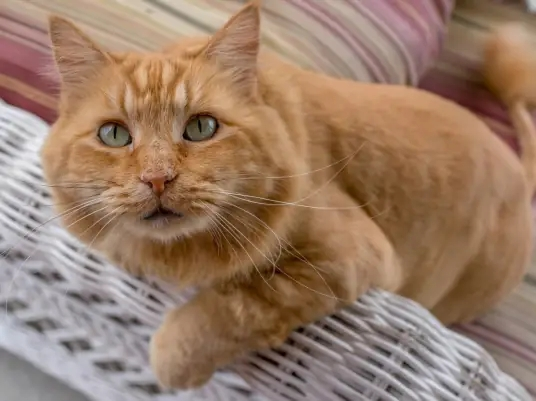
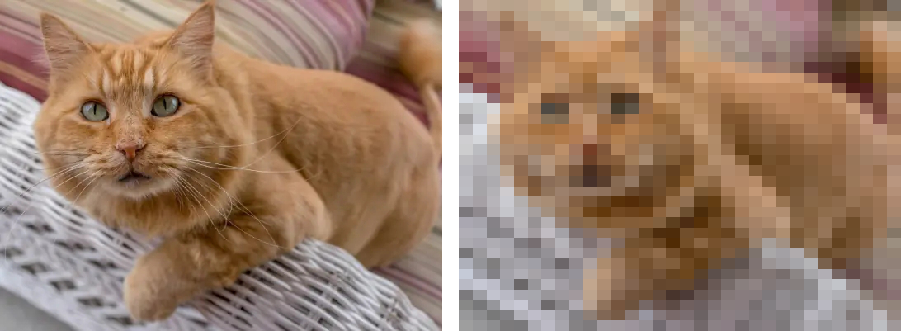

（请原谅我的取名方式）
距离笔者做完这个实验已经一周了，但直到现在才开始动笔记录，可以说我的拖延症已经无可救药了。

在学习 Pytorch的过程中，官方的**CIFAR-10 图像分类**可以说是最有名也是很有意思的一个机器学习实验，因此我也是迫不及待（存疑）地开始了我的第一次炼丹旅程~

先报一下我的硬件和环境：
硬件：RTX 5060 Laptop GPU + Intel Ultra 9 275HX（24 核）。

环境：torch 2.12.1+cu130，torchvision 0.27.1+cu130。

# CIFAR-10数据集训练

模型很简单，就用了三层神经网络卷积，然后对输入数据进行三次池化，最后全连接
```python
class Net(nn.Module):
    def __init__(self):
        super(Net, self).__init__()
        self.conv1 = nn.Conv2d(3, 32, 3, padding=1)
        self.conv2 = nn.Conv2d(32, 64, 3, padding=1)
        self.conv3 = nn.Conv2d(64, 128, 3, padding=1)
        self.pool = nn.MaxPool2d(2, 2)
        ...
```

迭代30轮，得到了如下结果：

|指标|数值|
|:---|:---|
|训练准确率|71.97%|
|验证准确率（最高）|**78.04%**|
|单轮耗时|~8秒|

接下来就是实际检验模型成果了，我建了个test_images文件夹，然后在网上找了一张猫的图片：


结果:

```text
cf1b9d...jpg -> 预测类别：dog（置信度 60.52%）
```

然后查看日志，发现排在第二的是cat 置信度36.29%

左图是原图，但由于输入预处理把照片缩到了 32×32；网络内再经过 3 次池化，特征图进一步压到 4×4，细节损失是“输入缩放 + 池化”叠加的结果。


分析原因，我想到了以下几条：
1. 照片被压成 **32×32**——536×401 的图缩到 1344 个像素，猫糊成了一团。
2. CIFAR-10 的模型只见过 **32×32 的小图**，真实照片的信息量完全不同
3. 10 个粗类别里，狗和猫本来就像，模型把类似一团"模糊毛团"判成了 dog。

于是很自然地，我想如何改进，至少让一个模型能自己识别出这张猫罢。

# ResNet18后训练

询问AI，得知ImageNet的存在，但看到单单ILSVRC2012就要一百多G，直接断了自己从头训练的念头（虽然后续知道有小一些的数据集）。

进而换成了用ImageNet预训练好的ResNet18，输入放大到了224×224，这也是为了（匹配预训练尺寸），进行微调。

```python
from torchvision import models

model = models.resnet18(weights=models.ResNet18_Weights.DEFAULT)
model.fc = nn.Linear(model.fc.in_features, 10)
```

结果对比（这一次因为参数量大了不少，故只迭代训练了10次）

| 模型              | 第 1 轮验证准确率 | 最终验证准确率          |
| --------------- | ---------- | ---------------- |
| 小 CNN 从零训练      | ~30%       | 78.04%（30 轮）     |
| 预训练 ResNet18 微调 | **92.91%** | **95.69%（10 轮）** |

# 训练过程中的优化

但在实际训练的时候，我发现我笔记本的功率常态稳定在100w，我打游戏的时候都能稳在200w以上，这绝对不合理，再看日志发现，gpu的利用率在12%到99%来回抽搐，当时我就猜估计是gpu的计算速度超过了数据加载的速度：

而在源代码中，num_workers=0就进一步佐证了我的猜想，询问AI得知，DataLoader不开多进程的时候，CPU预处理会和GPU计算串行，gpu算完了一批，cpu再开始处理下一批，但我在调了几次num_workers后，发现没有太大作用，我只好向agent求助了，agent 分析日志后，给出了一个和我猜想相反的结论：**瓶颈一开始根本不在 CPU**。它做了三组受控测速：

|配置|速度|
|---|---|
|FP32，`num_workers=0`|4.5 it/s|
|FP32，`num_workers=4`|4.5 it/s|
|bf16，`num_workers=4`|7.4 it/s|

`num_workers` 从 0 调到 4，速度纹丝不动。原因很直白：FP32 下 GPU 每批要算 222ms，而 CPU 预处理只要约 150ms——**GPU 自己就是最慢的那一环**。

真正的突破口是 **bf16 混合精度**。agent告诉我RTX 50 系的张量核心对 bf16 的吞吐接近翻倍（实测提速约 1.6 倍），权重和激活的张量存储减半（实测总显存 6.2→4.5GB）。当 GPU 每批从 222ms 压到 134ms 之后，CPU 预处理才第一次成为更慢的那一环——**这时 `num_workers=4` 才真正发力**，速度冲到 7.4 it/s。

**瓶颈是会转移的**。FP32 阶段瓶颈在 GPU，加 workers 是白费力气；bf16 让 GPU 变快后，瓶颈轮到 CPU，多进程取数才派上用场。优化必须跟着瓶颈走，而不是照搬别人的参数。

除此之外还有一个隐蔽的元凶：**进度条**。tqdm 在 Jupyter 里每批刷新一次，显示消息的开销被放大到肉眼可见的程度。加一行 `mininterval=1.0`，让进度条每秒最多刷一次，显示开销大幅降低。

最终改造就三处：

```python
with torch.autocast('cuda', dtype=torch.bfloat16):   # 混合精度
    outputs = model(inputs)
    loss = criterion(outputs, targets)

trainloader = DataLoader(..., num_workers=4, pin_memory=True, persistent_workers=True)
loop = tqdm(loader, desc='Training', mininterval=1.0)
```

结果：

|指标|优化前|优化后|
|---|---|---|
|训练速度|~2.1 it/s|**~7 it/s**|
|GPU 利用率|12%↔99% 抽搐|稳定 89~99%|
|GPU 功耗|~45W|~90W|
|显存|6.2GB|4.5GB|

三倍提速，GPU终于不摸鱼了，训练时长也从优化前每轮约 3 分钟、30 轮约 1.6 小时，降到优化后每轮约 1 分钟、10 轮约 10 分钟。

# 一个低质量的数据集为什么有用

但在对ResNet进行后训练的时候，有一个疑惑始终贯穿训练始终，那就是我依旧是用CIFAR-10数据集进行训练的，32×32直接放大到224×224真的有用吗？为什么loss也还是会降？

于是我又做了一个对照实验：

冻结ResNet18骨干，只训练最后一层分类头：

|配置|验证准确率|
|---|---|
|冻结骨干 + 只训分类头|81.84%|
|全量微调 10 轮|95.69%|
发现了很有意思的结论：
- **冻结的预训练特征 + 一个线性头（81.84%）就超过了小 CNN 从零练 30 轮（78.04%）**——预训练相当重要;
- 微调（骨干也参与更新）再补约 14 个点——其中大部分发生在**第 1 轮**;
- 正确公式是乘法不是加法：内容（CIFAR）决定"认什么"，预训练决定"学多快、天花板多高"。

最后，agent给出了让我比较满意的解答：

核心误区在于：“**完整的能力**”和“**能判断你的任务**”是两回事。预训练给的是“通用的看”，但没给“你这个任务”。

**1. 预训练模型的“能力”是对着 ImageNet 定义的**

ResNet18 学的是 1000 个 ImageNet 类别：120 种狗、十几种猫科动物、各种飞机型号……它的输出层在回答“这是 1000 类里的哪一类”。而 CIFAR-10 是另一套标签空间：10 个粗类别，且图片长成“32×32 放大的低清小图”的样子。**会看 ≠ 知道你要它分哪 10 类**。分类头是随机初始化的，这个“任务知识”必须靠 CIFAR 数据教会它。

**2. 质量差的数据集，恰恰定义了这个任务的“长相”**

CIFAR 的图片虽然模糊，但**模糊得一致**——所有猫都糊、所有飞机都糊、背景都简单居中。这种一致性本身就是可学的分布特征。微调学到的不是“看清细节”，而是“**在这个特定分布的图像里，哪些模式对应哪一类**”。所以 loss 照样降：因为有稳定的可学信号（映射 + 领域特点），跟画质无关。

**3. 用我们的实验数据拆开看“提高”到底发生在哪**

|阶段|验证准确率|学的是什么|
|---|---|---|
|预训练特征 + 随机头|~10%|啥也不会（只会瞎猜）|
|+ 只训分类头（冻结骨干）|81.84%|**学任务映射**：怎么用现成特征分这 10 类|
|+ 骨干也微调|95.69%|**领域适应**：把通用视觉特征微调到 CIFAR 的模糊分布上|

所以提高的不是“视力”——视力在冻结骨干时就已经是完整的了，照样只有 81.84%。**提高的是“用这份视力服务于这个任务”**：先学会映射（+72 个点），再学会适应这个低清领域的特殊癖好（+14 个点）。


# 总结

虽然后续用上了更大数据集训练的ResNet18，但由于我的后训练太过粗糙，其能力肯定是没有完整发挥的，但这过程确实让我学习到了很多，不管是一次完整的机器学习路径，还是训练中的优化问题，抑或是环境等等的配置，都是要实际上手才能知道该怎么做的。

纯新手，写的难免有些疏漏，望大佬不吝赐教。
